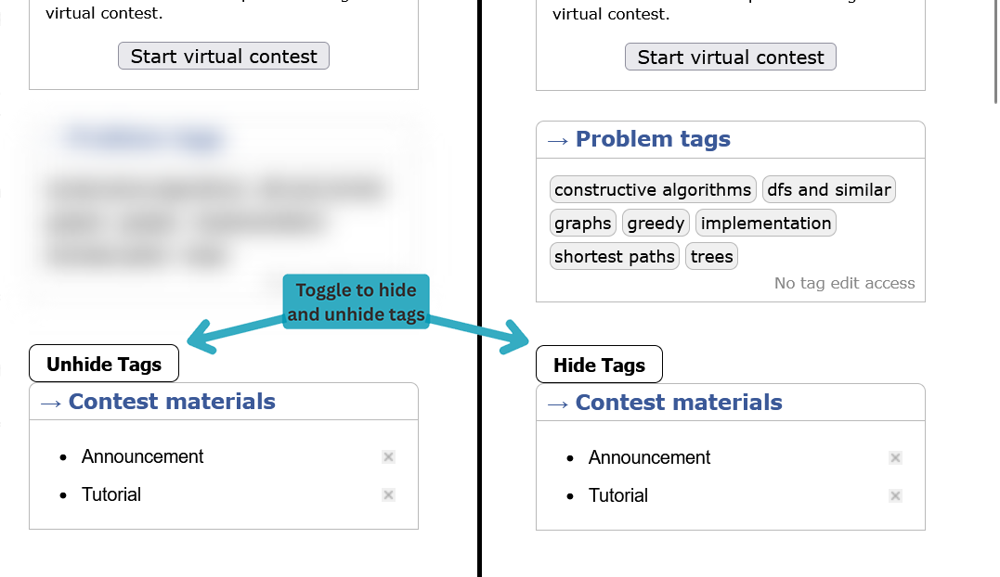

# Hide_Tags

*Hides the tags/spoilers of any problems on Codeforces*

### How To Use 

---

1. Install Tampermonkey extension from this (For chromium)[link](https://chromewebstore.google.com/detail/tampermonkey/dhdgffkkebhmkfjojejmpbldmpobfkfo) (for firefox)[link](https://addons.mozilla.org/en-US/firefox/addon/tampermonkey/)
2. Click Tampermonkey icon from the top bar , and click ``Create a new Script``
3. Paste the contents of script.js file in the Tampermonkey editor. Or open the script.js click on "Copy raw file" , CTRL+A , CTRL+C , CTRL+V in the Tampermonkey editor.
4. CTRL+S
5. Forget the worry of peeping the tags.
